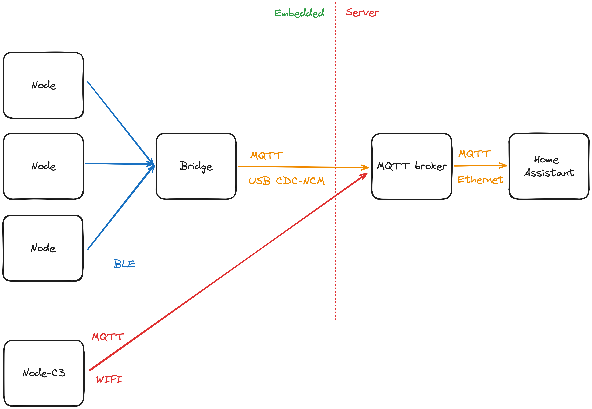
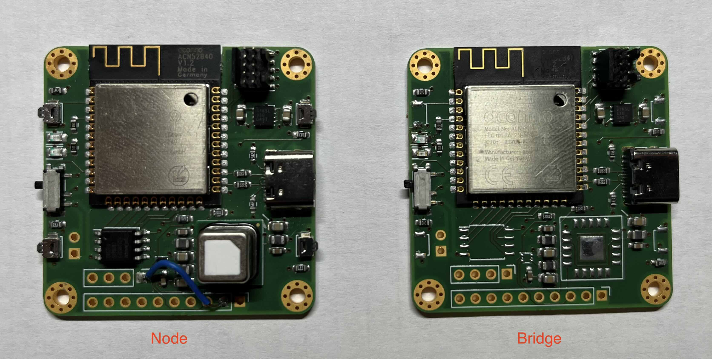
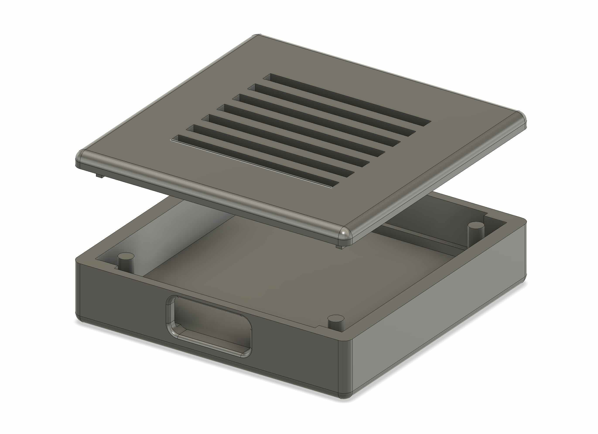

# Air Force One - a simple air quality measurement system
Air Force One is a simple air quality measurement systems primarily designed to measure CO2 concentration in multiple rooms of a small apartment. 
It consists of nodes responsible for measuring the data and broadcasting them using BLE advertisements and a bridge which periodically receives the data and publishes them over MQTT for further processing - in this case displaying them in dashboards of Home Assistant.
There are two types of nodes which differ in used hardware and therefore communication protocol. The project was originally developed with the Bluetooth ones in mind, while the ESP32/WiFi one was added only as an experiment.

An overview of the system can be seen in the following image.


## Project structure
* `node-fw` - firmware for the Bluetooth node
* `node-c3` - firmware for the ESP32/WiFi node
* `bridge-fw` - firmware for the Bluetooth bridge
* `shared` - shared library for node and bridge firmware
* `pcb` - design files for the electronics
* `case` - design files for the case

## Hardware
The hardware for this project is based on Nordic's nRF52840 bluetooth enabled MCU. CO2 concentration, temperature and humidity are measured by a Sensirion SCD41 sensor.
The hardware was developed to allow for more features in the future so apart from the SCD41, there are more on-board parts:
* QSPI flash for measurements logging
* 4 buttons
* a connector and a hardware switch for connecting external battery (the circuitry however was not optimized for low-power even though it is well supported with embassy on nRF52)
* SHT4x sensor for more precise temperature and humidity measurements (the sensors were either badly wired or damaged on prototype boards, so no support for them was added)
* broken out pins allowing for some extensibility

The nodes and the bridge do not differ hardware wise, but the prototype bridge didn't have assembled anything other than the nRF52 module, LDO and USB circuitry to save parts, so no measurement support is available in the bridge firmware. The difference between them can be seen in the following image.


For firmware flashing a SWD probe is required. The programming connector on-board is the 10-pin Cortex-M debug connector with 1.27 mm pitch. An example of a usable probe with the same connector is the [hs-probe](https://github.com/probe-rs/hs-probe). 

There is also a case available fitting the PCB shape.


## Firmware
The firmware for both the node and the bridge is written in Rust and utilizes [embassy](https://embassy.dev) async framework as well as [nrf-softdevice](https://github.com/embassy-rs/nrf-softdevice) for bluetooth support.
As such it is assumed that you have standard embedded Rust development tools installed - such as [probe-rs](https://probe.rs/).

To use the firmware, Nordic's softdevice must first be flashed to the MCU.

1. First download the Softdevice from [here](https://www.nordicsemi.com/Software-and-tools/Software/S140/Download)
2. Mass erase the MCU `probe-rs erase --chip nrf52840_xxAA`
3. Flash the softdevice `probe-rs download --verify --format hex --chip nRF52840_xxAA s140_nrf52_7.X.X_softdevice.hex`

> Mass erasing the MCU has an unfortunate side effect of disabling reset pin. The firmwares in this repository reenable this functionality on startup.

Both of the firmware have their panic behavior configured to automatic reset, for development purposes however, it is better to switch to `panic-probe` panic handler using the 'dev' feature that can be passed to cargo.

### Node Firmware
Firmware for the node periodically reads data from the SCD41 sensor and updates Manufacturer Specific Data that are part of BLE advertisement.
For accessing the SCD41 sensor, the firmware uses the [sensirion-async](https://github.com/matoushybl/sensirion-async) library.

Flashing the firmware can be done in the `node-fw` directory by running `cargo run --release`.

### Bridge Firmware
Firmware for the bridge scans for available nodes and reads the Manufacturer Specific data part of the node's advertisement. A CDC-NCM bridge is utilized to establish a connection to a MQTT broker. Data read from the scans are then published via the broker. Static IP addresses are utilized in this configuration.

Flashing the firmware can be done in the `bridge-fw` directory by running `cargo run --release`.

## Experimental ESP32/WiFi node
As an experiment a node based on ESP32-C3 was developed. The firmware for this node is written using a similar technological stack as the nRf52 firmware - Rust and embassy. The firmware is located in the `node-c3` directory. A defining difference is that this node directly accesses the MQTT broker, making it much more simpler and hopefully more reliable.

This node also utilizes off-the-shelf hardware, so no custom PCB is requried. In this case [this ESP32-C3 board](https://www.laskakit.cz/laskkit-esp-12-board/?variantId=10482) [this SCD41 breakout board](https://www.laskakit.cz/laskakit-scd41-senzor-co2--teploty-a-vlhkosti-vzduchu/) were used, but any development kits should work the same (apart from assigning pins for the I2C).

When building the firmware SSID, password and MQTT broker address must be set as environent variables. Refer to the respective `main.rs` for environment variable names.

> As of time of publishing, the firmware uses unreleased esp-rs crates - `esp-backtrace` and `esp-println` alongside with `espflash` tool. These were used to add support for defmt.

## Accessing the measured data

### Configuring the network interface
The network interface can either be configured one-time using the `ip` command or using netplan on Ubuntu using a similar config to the one below. Using netplan has an advantage of the configuration being persistent over reboots and bridge reconnects.

The following config sets a static IP on the USB CDC-NCM interface.

```
network:
  version: 2
  renderer: networkd
  ethernets:
      enx888888888888:
          optional: true
          dhcp4: no
          addresses: [10.42.0.1/24]
```

### MQTT
The bridge firmware expects an MQTT broker running on the computer it is connected to. A simple way to spin up the broker is to use docker.
```
docker run -it -p 1883:1883 -v $(pwd)/mosquitto.conf:/mosquitto/config/mosquitto.conf eclipse-mosquitto
```

The bridge expects the broker to run without authentication, which can be achieved by the following `mosquitto.conf`:
```
listener 1883
allow_anonymous true
```

### Home Assistant
Once the measured data are published to the broker, MQTT integration in Home Assistant can be used to access the measured data. A sample Home Assistant configuration can be found below.

```yaml
mqtt:
  sensor:
    - name: "Bedroom - co2"
      state_topic: "afo-1"
      unit_of_measurement: "PPM"
      value_template: "{{ value_json.co2 }}"
      device_class: "carbon_dioxide"
    - name: "Bedroom - humidity"
      state_topic: "afo-1"
      unit_of_measurement: "%"
      value_template: "{{ value_json.humidity }}"
      device_class: "humidity"
    - name: "Bedroom - temperature"
      state_topic: "afo-1"
      unit_of_measurement: "°C"
      suggested_display_precision: 1
      value_template: "{{ value_json.temperature }}"
      device_class: "temperature"
    - name: "Living room - co2"
      state_topic: "afo-0"
      unit_of_measurement: "PPM"
      value_template: "{{ value_json.co2 }}"
      device_class: "carbon_dioxide"
    - name: "Living room - humidity"
      state_topic: "afo-0"
      unit_of_measurement: "%"
      value_template: "{{ value_json.humidity }}"
      device_class: "humidity"
    - name: "Living room - temperature"
      state_topic: "afo-0"
      unit_of_measurement: "°C"
      suggested_display_precision: 1
      value_template: "{{ value_json.temperature }}"
      device_class: "temperature"
```
